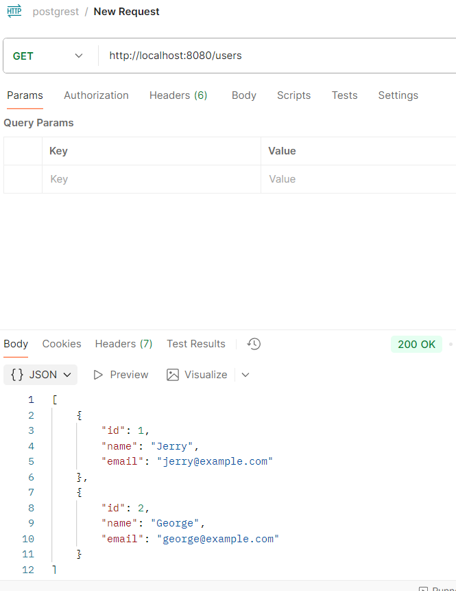

# block-simple


### 1. Título y Descripción

sample node js code use to create the docker compose
- https://blog.logrocket.com/crud-rest-api-node-js-express-postgresql/

```markdown

# Block Simple

It is node js api  to list  update and create users 


**Curso:**  Docker & Kubernetes - Clase 3
**Estudiante:**  Ronald Choque Fuentes
**Fecha:** 10/08/2025

```


### Common Command to clean docker


```bash
docker system prune
docker images prune
docker stop $(docker ps -a -q)
docker rmi $(docker images -q)
docker volume rm :id
docker network rm :id

```

### 2. Stack Tecnológico

Lista las tecnologías usadas:

```markdown
## Stack Tecnológico

- **Backend:** Node.js + Express .
- **Base de datos:** PostgreSQL 15 c.
```

### 3. Arquitectura

Diagrama o descripción de la arquitectura:

```markdown
## Arquitectura

It use two services and nodeapp and db.  those are connected by common network.
the database use  a env file variables to set and  deploy the database.

Servicios:
- `app`: Puerto 8080, conectado a db 
- `db`: PostgreSQL, solo accesible desde app

```

Puedes incluir un diagrama ASCII o imagen.

## docker compose File
[docker compose File](docker-compose.yml)

## docker File
[node js docker file](app/Dockerfile)

## enviroment file variables for postgres
[postgres variables](.env)

##  Config File for postgrest
[SQL INIT](config/init.sql)

### 4. Requisitos Previos

```markdown
## Requisitos

- Docker Desktop o Docker Engine
- Docker Compose
- Git
```

### 5. Instalación y Uso

Instrucciones paso a paso:

```markdown
## Instalación

1. Clonar el repositorio:
   ```bash
   git clone https://github.com/RonaldChoqueFuentes/block-simple.git
   cd block-simple
   ```

2. update default enviroment variables  :
 

3. Levantar servicios:
   ```bash
   docker compose up -d
   ```

4. Acceder a la aplicación:
   - API: http://localhost:8080
   - postgres database address: http://db:5432


### 6. Endpoints / Funcionalidad

Documenta cómo usar tu aplicación:

```markdown
## Endpoints

- `GET /` - default response
- `GET /users` - Listar users
- `GET /users/:id` - get a user
- `POST /users` -  create a user
- `PUT /users/:id'` -  update a user
- `DELETE /users/:id'` -  delete a user
```

## endpoint Screenshoots

- http://localhost:8080


- GET http://localhost:8080/users




- GET http://localhost:8080/users/1


- POST http://localhost:8080/users?name=ronald&email=ron.todo.poderoso@gmail.com


- PUT http://localhost:8080/users/3?name=javier


- DELETE http://localhost:8080/users/2

